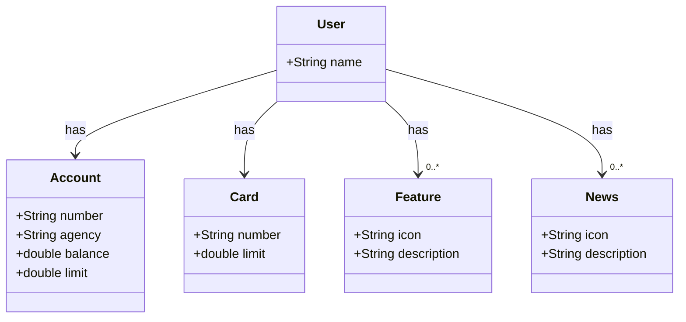

# Bradesco Java Cloud Native
[Java RESTful API] Publicando sua API REST na Nuvem Usando Spring Boot 3, Java 17 e Railway

## Diagrama de Classes

### Criação do Projeto
 * Criação: Spring Initializr
 * Versionamento da API: GitHub
 * Abstração e Modelagem de Domínio: Figma, ChatGPT(Mermaid) e JPA
 * Implementação do Backend: Spring Boot e Java 17
 * Deploy e Monitoramento: RailWay (PostgreSQL e CI/CD da API)
   
### Social Media
* Instagram: https://www.instagram.com/argeu.souza
* My GitHub: https://www.github.com/argeulimbo
* Linkedin: https://www.linkedin.com/in/argeu-phelipe-de-souza-40053a227/
